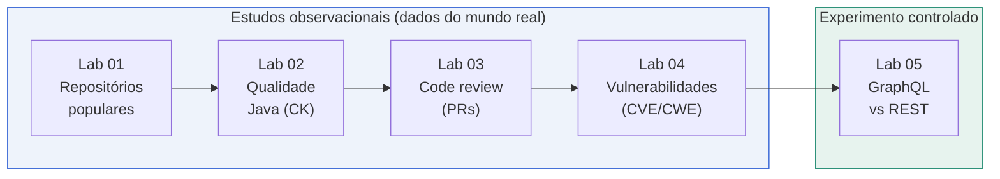

<div align="center">

# Laboratório de Experimentação de Software

**Estudos empíricos e experimentos controlados sobre engenharia de software**
_Repositórios populares · Qualidade de código · Code review · Vulnerabilidades · APIs Web_

Engenharia de Software · 6º Período

<br/>


</div>

---

## Sumário

- [Sobre o repositório](#sobre-o-repositório)
- [Visão geral dos laboratórios](#visão-geral-dos-laboratórios)
- [Lab 01 — Características de repositórios populares](#lab-01--características-de-repositórios-populares)
- [Lab 02 — Qualidade de sistemas Java (CK)](#lab-02--qualidade-de-sistemas-java-ck)
- [Lab 03 — Atividade de code review no GitHub](#lab-03--atividade-de-code-review-no-github)
- [Lab 04 — Vulnerabilidades de software (CVE/CWE)](#lab-04--vulnerabilidades-de-software-cvecwe)
- [Lab 05 — GraphQL vs REST: experimento controlado](#lab-05--graphql-vs-rest-experimento-controlado)
- [Stack de tecnologias](#stack-de-tecnologias)
- [Estrutura do repositório](#estrutura-do-repositório)
- [Autores](#autores)

---

## Sobre o repositório

Este repositório reúne os cinco laboratórios da disciplina **Laboratório de Experimentação de Software**. Cada laboratório (`Enunciado N`) é um estudo empírico completo, organizado em **sprints**, que parte de uma pergunta de pesquisa, coleta dados de fontes reais (GitHub, bases de vulnerabilidades) ou de um cenário controlado, aplica **métodos estatísticos** e entrega **relatórios e dashboards**.

A coletânea cobre uma progressão metodológica que vai do **estudo descritivo** ao **experimento controlado**:



> **Descritivo → Correlacional → Experimental:** os Labs 01–04 *observam* como o software real se comporta (caracterização e correlações); o Lab 05 *manipula* variáveis em um ambiente controlado para estabelecer relações de causa e efeito.

---

## Visão geral dos laboratórios

| # | Tema | Pergunta central | Dados analisados | Método estatístico | Stack |
|:-:|------|------------------|------------------|--------------------|-------|
| **01** | Repositórios populares | Como são os repositórios mais estrelados do GitHub? | 1.000 repositórios | Estatísticas descritivas (medianas, contagens) | C# · .NET · GraphQL |
| **02** | Qualidade Java | Atributos de processo influenciam a qualidade do código? | 1.000 repos Java + métricas CK | Correlação de Pearson/Spearman, quartis | C# · .NET · CK · GraphQL |
| **03** | Code review | O que diferencia PRs aceitos de rejeitados? | ~10.333 pull requests (200 repos) | Correlação de Spearman, medianas | C# · .NET · GraphQL |
| **04** | Vulnerabilidades | Quais fraquezas (CWE) concentram e ameaçam mais? | 253.802 CVEs · 749 CWEs | Pareto/Gini, Kruskal-Wallis, Spearman | C# · .NET · Power BI |
| **05** | GraphQL vs REST | GraphQL é mais rápido e mais leve que REST? | 1.200 medições controladas | Experimento controlado, Mann-Whitney U, Cliff's δ | C# · .NET · pandas/seaborn |

---

## Lab 01 — Características de repositórios populares

> **Tipo de estudo:** observacional / descritivo · **Fonte:** GitHub GraphQL API

### O que faz
Coleta e analisa os **1.000 repositórios com mais estrelas** do GitHub para **caracterizar** o perfil dos projetos open-source mais populares.

### O que tenta explicar
Se popularidade anda junto com **maturidade, manutenção ativa e saúde do projeto** — ou seja, se "ter muitas estrelas" significa ser antigo, bem mantido e organizado.

| RQ | Pergunta | Métrica |
|:--:|----------|---------|
| 01 | Sistemas populares são maduros/antigos? | Idade do repositório (anos) |
| 02 | Recebem muita contribuição externa? | Pull requests aceitas |
| 03 | Lançam releases com frequência? | Total de releases |
| 04 | São atualizados com frequência? | Dias desde a última atualização |
| 05 | Usam linguagens populares? | Linguagem primária |
| 06 | Mantêm as issues sob controle? | % de issues fechadas |
| 07 | _(bônus)_ A linguagem influencia os indicadores? | Medianas por linguagem |

### Como faz
Consulta **paginada** à API GraphQL do GitHub (poucas chamadas para 1.000 repos), exportação em CSV e cálculo de **medianas** por RQ numérica e **contagens** por categoria. Saída em console rico (Spectre.Console), relatório `.txt` e `.csv`.

### Principais resultados
> Idade mediana **≈ 8,5 anos**, **737** PRs aceitas (mediana), **40** releases (mediana), atualização tipicamente **no mesmo dia** e **≈ 88%** de issues fechadas. Linguagens dominantes: **Python, TypeScript e JavaScript**. Popularidade tende, de fato, a acompanhar maturidade e manutenção ativa.

---

## Lab 02 — Qualidade de sistemas Java (CK)

> **Tipo de estudo:** observacional / correlacional · **Fonte:** GitHub + ferramenta CK

### O que faz
Seleciona os **1.000 repositórios Java mais populares**, clona cada um e mede **atributos de qualidade interna** com a ferramenta [CK](https://github.com/mauricioaniche/ck) (Chidamber & Kemerer).

### O que tenta explicar
Se **características de processo** (popularidade, maturidade, atividade e tamanho) se relacionam com a **qualidade do código**, medida por:
- **CBO** (Coupling Between Objects) — acoplamento
- **DIT** (Depth of Inheritance Tree) — profundidade de herança
- **LCOM** (Lack of Cohesion of Methods) — falta de coesão

| RQ | Relação investigada |
|:--:|---------------------|
| 01 | Popularidade (estrelas) × qualidade (CBO/DIT/LCOM) |
| 02 | Maturidade (idade) × qualidade |
| 03 | Atividade (releases) × qualidade |
| 04 | Tamanho (LOC) × qualidade |

### Como faz
Pipeline automatizado (Sprint 1 → 2 → 3): coleta via GitHub, **clone + execução do CK** em lote, consolidação em um único CSV, **estatísticas descritivas**, estratificação por **quartis** e correlações de **Pearson e Spearman** (com p-valor). Entrega relatório **Markdown + PDF** e gráficos.

### Principais resultados
> Sobre **962** repositórios com CK medido: as relações mais fortes (Spearman) foram **releases × CBO (ρ ≈ 0,40)**, **LOC × LCOM (ρ ≈ 0,45)** e **idade × DIT (ρ ≈ 0,28)**. Projetos maiores e mais ativos tendem a apresentar mais acoplamento e menor coesão — correlações de fracas a moderadas, nunca determinísticas.

---

## Lab 03 — Atividade de code review no GitHub

> **Tipo de estudo:** observacional / correlacional · **Fonte:** GitHub GraphQL API

### O que faz
Caracteriza a **atividade de code review** a partir de **~10.333 pull requests** dos 200 repositórios mais populares (com ≥ 100 PRs fechados), considerando apenas PRs com **revisão real** (≥ 1 revisão e tempo de análise > 1 h, para excluir bots/CI).

### O que tenta explicar
Quais atributos de um PR estão associados ao seu **desfecho** (aceito **MERGED** vs rejeitado **CLOSED**) e ao **esforço de revisão** (número de revisões).

| RQ | Dimensão | vs |
|:--:|----------|----|
| 01–04 | Tamanho · Tempo de análise · Descrição · Interações | **Status final** (MERGED/CLOSED) |
| 05–08 | Tamanho · Tempo de análise · Descrição · Interações | **Nº de revisões** |

### Como faz
Coleta via GraphQL com filtros de qualidade, cálculo de **medianas** por grupo e **correlação de Spearman** (não-paramétrica, robusta a outliers e caudas longas). Visualizações (box plots, scatter plots) e relatório **Markdown + PDF**.

### Principais resultados
> **77,3%** dos PRs foram aceitos (MERGED). Curiosamente, os PRs **CLOSED** (rejeitados) tendem a ser ligeiramente **menores**, a demorar **mais** para fechar (mediana **≈ 39 h** vs **≈ 13 h** dos aceitos) e a acumular **mais comentários** — indicando que a rejeição costuma surgir de discussões longas e sem consenso, e não do tamanho do PR.

---

## Lab 04 — Vulnerabilidades de software (CVE/CWE)

> **Tipo de estudo:** observacional / analítico · **Fonte:** base pública de CVEs (artigo TI6)

### O que faz
Analisa um grande catálogo de **253.802 CVEs**, **278.912 relações CVE↔CWE** e **749 CWEs** para entender o panorama de **fraquezas de software** e priorizar risco.

### O que tenta explicar
Onde se concentram as vulnerabilidades, quais fraquezas são mais **perigosas** e se **frequência** equivale a **periculosidade**.

| RQ | Pergunta | Veredito |
|:--:|----------|----------|
| 01 | Quais CWEs concentram a maior parte das vulnerabilidades? | **Confirmada** — 38 CWEs cobrem 80% (Gini ≈ 0,92) |
| 02 | Quais CWEs têm maior potencial técnico de dano (CVSS)? | **Confirmada** — Kruskal-Wallis p < 0,001 |
| 03 | Ser frequente é o mesmo que ser perigoso? | **Confirmada com nuance** — ρ ≈ −0,02, mas **53 CWEs** em "dupla ameaça" |

### Como faz
Caracterização do dataset (distribuição por ano, severidade e CVSS), **análise de Pareto e curva de Lorenz/Gini** para concentração, **Kruskal-Wallis** para diferença de CVSS entre grupos e **Spearman** para frequência × severidade. Constrói uma **fila de priorização de risco** e entrega **dashboards HTML + Power BI** no formato de artigo **TI6**.

### Principais resultados
> Poucas fraquezas dominam o cenário: **SQL Injection, Out-of-bounds Write e Buffer Overflow** lideram a fila de risco. Frequência e severidade são **eixos quase independentes** — algumas CWEs são raras mas críticas, e 53 são, ao mesmo tempo, frequentes **e** graves (prioridade máxima de mitigação).

[Dashboard interativo (Power BI)](https://app.powerbi.com/view?r=eyJrIjoiYjczODZhZTktNmZmOC00ZjFkLWE2NmYtYWUzZWM4MjYzNDBjIiwidCI6IjE0Y2JkNWE3LWVjOTQtNDZiYS1iMzE0LWNjMGZjOTcyYTE2MSIsImMiOjh9&embedImagePlaceholder=true&pageName=235dda5f203bd9435d80)

---

## Lab 05 — GraphQL vs REST: experimento controlado

> **Tipo de estudo:** experimento controlado · **Fonte:** cenário sintético local e determinístico

### O que faz
Compara, em um **experimento controlado e reprodutível**, os estilos de API **REST** e **GraphQL** sobre o mesmo domínio de dados, medindo **1.200 trials** (5 cenários × 2 tratamentos × 120 repetições).

### O que tenta explicar
Se a adoção do GraphQL traz **benefícios quantitativos** mensuráveis frente ao REST.

| RQ | Pergunta | Hipótese alternativa | Resultado |
|:--:|----------|----------------------|-----------|
| 01 | Respostas GraphQL são mais **rápidas**? | H1-1: tempo GraphQL < REST | **H1-1 apoiada** |
| 02 | Respostas GraphQL são **menores**? | H1-2: tamanho GraphQL < REST | **H1-2 apoiada** |

### Como faz
Projeto **intra-sujeitos** com ordem dos trials aleatorizada (semente fixa) e rodadas de aquecimento. As Sprints 1–3 em C# desenham o experimento, coletam medições e calculam **Mann-Whitney U** + **Cliff's delta**. Um **dashboard em Python** (pandas + matplotlib/seaborn) importa os dados e gera os gráficos e tabelas em um formato de **apresentação com navegação por abas**.

### Principais resultados
> GraphQL venceu em **5/5 cenários** nas duas métricas (todos com p < 0,0001): **−81,54%** no tempo mediano agregado e **−90,33%** no tamanho mediano. O efeito principal é a eliminação do **over-fetching**, já que o cliente declara apenas os campos necessários.

<table>
<tr>
<td width="50%"></td>
<td width="50%"></td>
</tr>
</table>

---

## Stack de tecnologias

| Camada | Tecnologias |
|--------|-------------|
| **Linguagens** | C# (.NET 10), Python 3.12 |
| **Coleta de dados** | GitHub GraphQL API v4, GitHub REST API, bases públicas de CVE |
| **Análise & métricas** | CK (Chidamber & Kemerer), MathNet.Numerics, pandas, NumPy |
| **Estatística** | Medianas/quartis, Pearson, Spearman, Mann-Whitney U, Kruskal-Wallis, Cliff's delta, Pareto/Gini |
| **Visualização** | matplotlib, seaborn, Spectre.Console, dashboards HTML, Power BI |
| **Relatórios** | Markdown, PDF, CSV |

---

## Estrutura do repositório

```text
lab-experimentacao/
├── Enunciado 1/   # Repositórios populares do GitHub (descritivo)
├── Enunciado 2/   # Qualidade de sistemas Java com CK (correlacional)
├── Enunciado 3/   # Atividade de code review / pull requests (correlacional)
├── Enunciado 4/   # Vulnerabilidades CVE/CWE — artigo TI6 (analítico)
├── Enunciado 5/   # GraphQL vs REST — experimento controlado
│   ├── Sprint 1..3/            # pipeline em C# (desenho, execução, dashboard)
│   ├── dashboard/              # dashboard em Python (pandas + seaborn)
│   └── lab05_entrega/          # dados, relatórios e dashboards finais
└── README.md
```

Cada `Enunciado N` é dividido em **Sprints** que seguem o ciclo do método experimental: **desenho → coleta/preparação → execução → análise → relatório/dashboard**. Os detalhes de execução de cada laboratório estão nos seus respectivos `README.md` / `LEIA-ME.md`.

---

## Autores

| Autor |
|-------|
| Sthel Felipe Torres |
| Vinicius Xavier Ramalho |

<div align="center">

---

_Engenharia de Software · Laboratório de Experimentação de Software_

</div>
